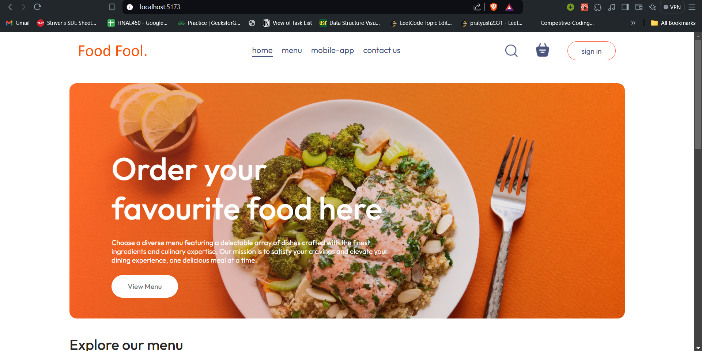
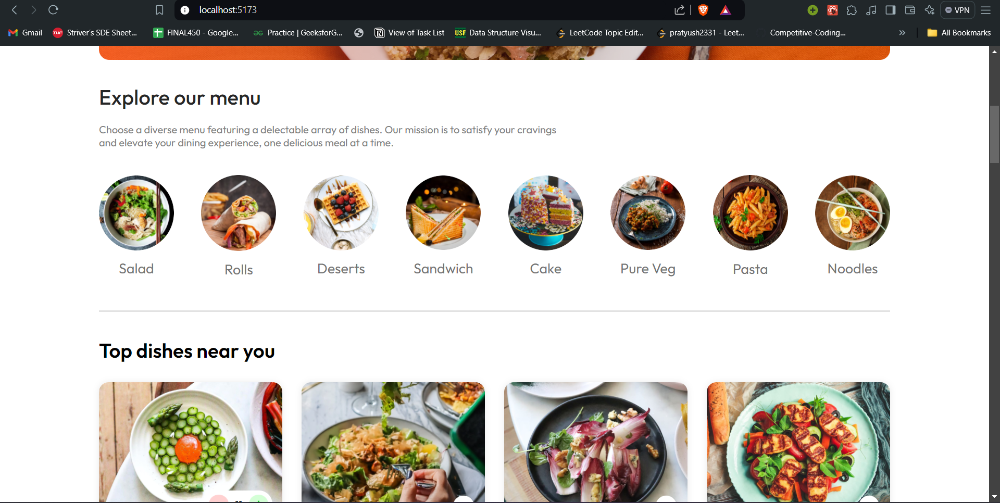
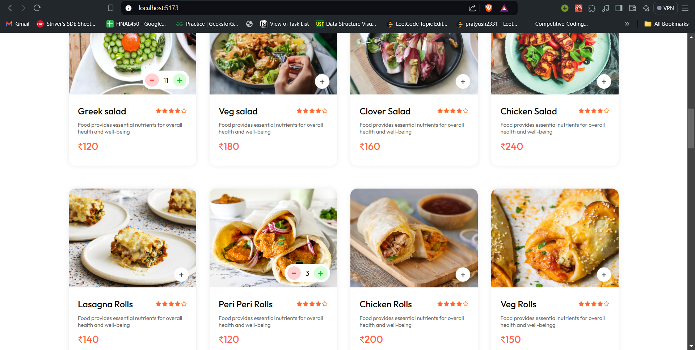
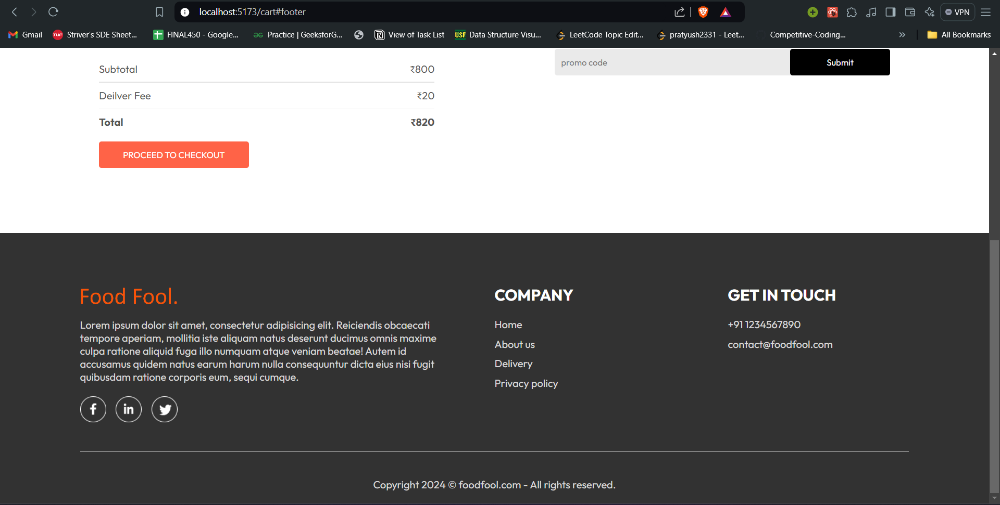
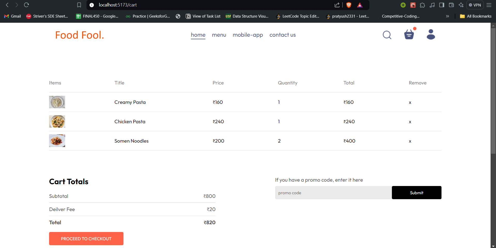
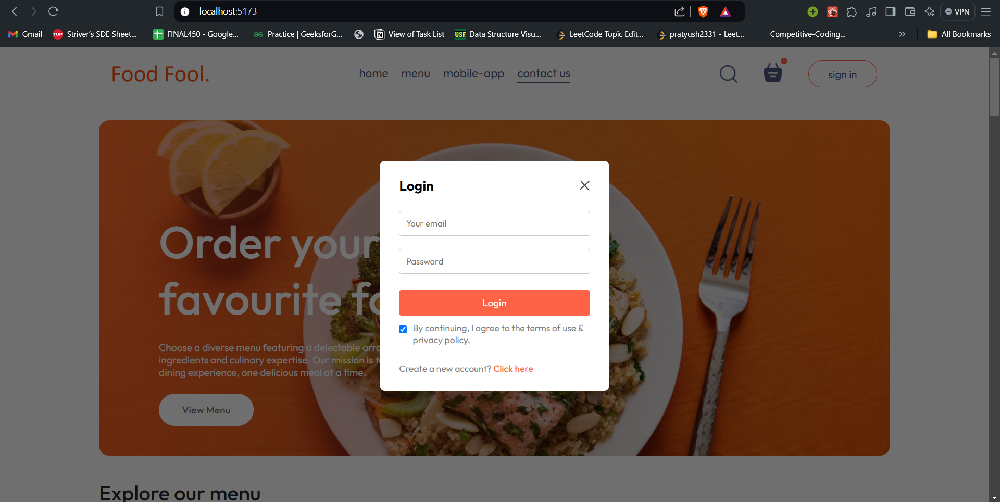

# Food Fool - A Food Delivery Website

**Food Fool** is a full-stack food delivery application built using the MERN stack (MongoDB, Express, React, Node.js). This project allows users to browse a menu, add food items to their cart, place an order, and complete payment using Stripe. It includes user authentication and an admin panel for managing products.

## Table of Contents

- [Screenshots](#Screenshots)
- [Tech Stack](#tech-stack)
- [Features](#features)
- [Installation](#installation)
- [Running the Project](#running-the-project)

---

## Screenshots
- Home page


- Filter Dish


- Food Items with add & remove functionality


- Footer


- Cart


- Signin and Login Functionality



## Tech Stack

### Frontend:
- **React.js**: JavaScript library for building user interfaces.
- **Context API**: Used for state management.
- **CSS**: For styling components and ensuring responsiveness.
- **Axios**: For making HTTP requests from the frontend to the backend.

### Backend:
- **Node.js**: JavaScript runtime for server-side development.
- **Express.js**: Web framework for handling server and API requests.
- **Multer**: Middleware for handling file uploads (used in the admin panel for uploading food item images).

### Database:
- **MongoDB**: NoSQL database for storing food items, user information, and orders.

### Authentication:
- **JWT (JSON Web Tokens)**: For user authentication.
- **bcrypt**: For password hashing.

---

## Features

- **User Authentication**: Sign up, log in, and secure routes for authenticated users.
- **Product Management**: Admins can add, update, and remove food items.
- **Cart and Order**: Users can add food items to their cart, view cart details, and place an order.
- **Responsive Design**: Fully responsive layout for a seamless experience on all devices.

---

## Installation

1. Clone the repository:

    ```bash
    git clone https://github.com/your-username/food-fool.git
    cd food-fool
    ```

2. Install dependencies:

    - **Backend**:
      ```bash
      cd backend
      npm install
      ```

    - **Frontend**:
      ```bash
      cd frontend
      npm install
      ```

   - **Admin Panel**:
      ```bash
      cd admin
      npm install
      ```

3. Set up environment variables:

    - Create a `.env` file in the `server` directory and add the following:
    ```bash
    JWT_SECRET=your-jwt-secret
    ```

---

## Running the Project

1. Start the backend server:

    ```bash
    npm run server
    ```

2. Start the frontend development server:

    ```bash
    npm run dev
    ```
3. Start the frontend development server for (admin panel):

    ```bash
    npm run dev
    ```

- The frontend will run on `http://localhost:5173`.
- The backend API will run on `http://localhost:4000`.